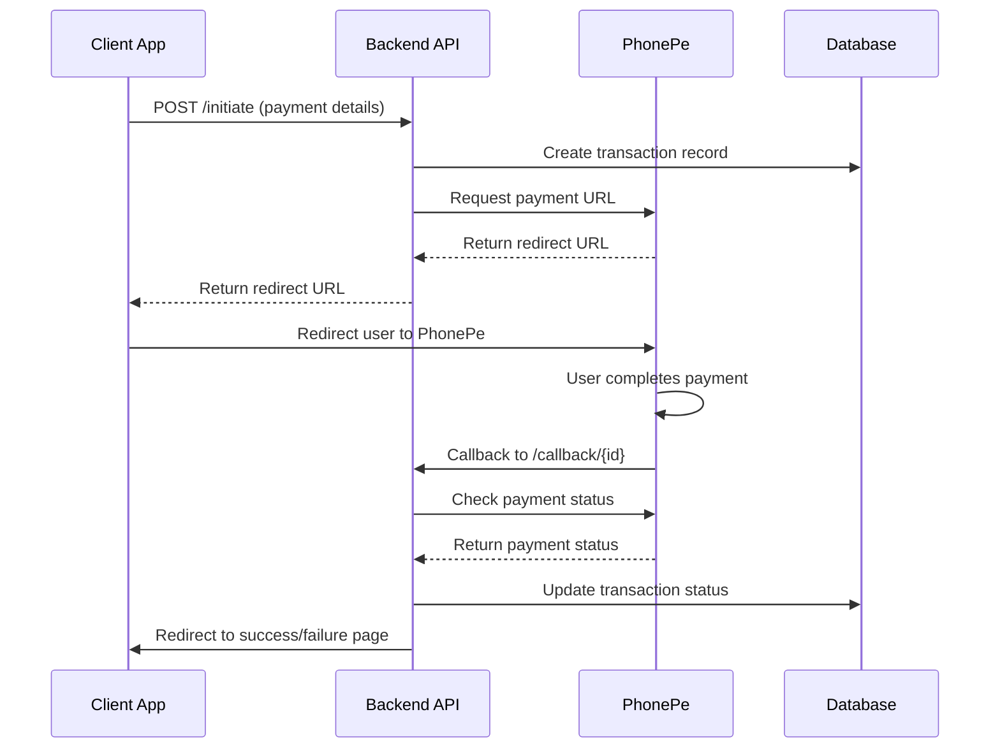
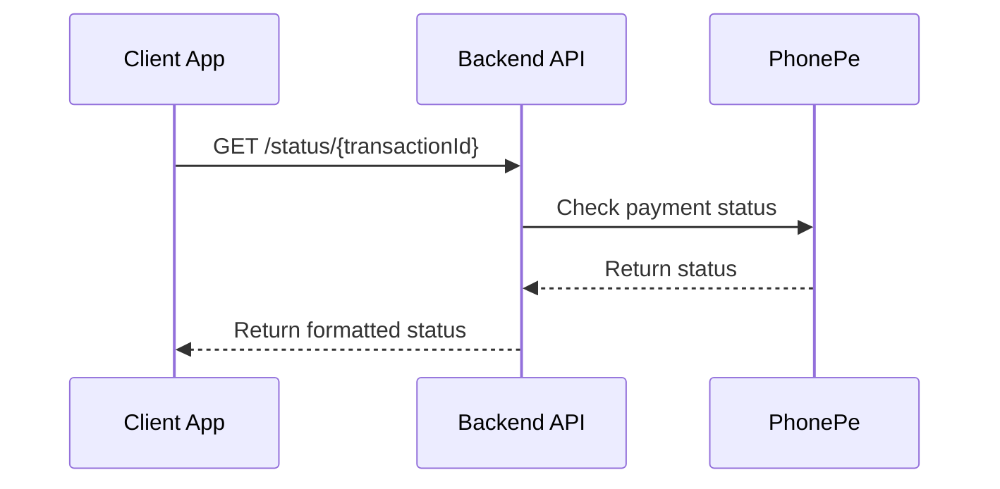

# PhonePe Payment Gateway Integration

This document provides a comprehensive guide for the PhonePe payment gateway integration implemented in the asset management backend system.

## Overview

The PhonePe integration provides a complete payment solution with the following features:

- **Payment Initiation**: Securely initiate payments through PhonePe
- **Payment Status Tracking**: Real-time payment status monitoring
- **Callback Handling**: Automated payment completion processing
- **Refund Processing**: Initiate and track refunds
- **Transaction Management**: Comprehensive transaction history and statistics
- **Webhook Support**: Handle PhonePe notifications
- **Security**: Signature validation and secure checksum generation

## Architecture

The integration follows the project's modular architecture:

```
src/
├── services/phonepe.service.ts      # Core PhonePe business logic
├── controllers/phonepe.controller.ts # API endpoint handlers
├── schemas/phonepe.schema.ts        # Input validation schemas
└── routes/phonepe.route.ts          # Route definitions
```

## API Endpoints

### Payment Operations

#### 1. Initiate Payment
```http
POST /v1/phonepe/initiate
Content-Type: application/json

{
  "merchantTransactionId": "TXN_1234567890",  // Optional: Auto-generated if not provided
  "amount": 100.50,
  "name": "John Doe",
  "mobileNumber": "9876543210",
  "userId": 1,
  "productIds": [1, 2, 3],                    // Optional
  "transactionFor": "product_purchase",       // Optional
  "callbackUrl": "https://yoursite.com/callback" // Optional
}
```

**Response:**
```json
{
  "success": true,
  "message": "Payment initiated successfully",
  "data": {
    "merchantTransactionId": "TXN_1234567890",
    "redirectUrl": "https://mercury.phonepe.com/...",
    "amount": 100.50,
    "status": "INITIATED"
  }
}
```

#### 2. Check Payment Status
```http
GET /v1/phonepe/status/{merchantTransactionId}
```

**Response:**
```json
{
  "success": true,
  "message": "Payment status retrieved successfully",
  "data": {
    "merchantTransactionId": "TXN_1234567890",
    "status": "PAYMENT_SUCCESS",
    "success": true,
    "message": "Your payment is successful.",
    "paymentData": {
      "merchantId": "PGTESTPAYUAT86",
      "merchantTransactionId": "TXN_1234567890",
      "transactionId": "T2111221437456190170379",
      "amount": 10050,
      "state": "COMPLETED",
      "responseCode": "SUCCESS",
      "paymentInstrument": {
        "type": "UPI",
        "pgTransactionId": "PG2111221437456190170379"
      }
    }
  }
}
```

#### 3. Process Refund
```http
POST /v1/phonepe/refund/{merchantTransactionId}
Content-Type: application/json

{
  "refundAmount": 50.25,  // Optional: Defaults to full amount
  "reason": "Customer requested refund"  // Optional
}
```

### Transaction Management

#### 4. Get User Transaction History
```http
GET /v1/phonepe/user/{userId}/transactions?page=1&limit=10
```

#### 5. Get Transaction Statistics
```http
GET /v1/phonepe/stats?userId=1  // userId is optional
```

### Utility Endpoints

#### 6. Generate Transaction ID
```http
GET /v1/phonepe/generate-transaction-id?prefix=ORDER
```

#### 7. Health Check
```http
GET /v1/phonepe/health
```

#### 8. Webhook Handler
```http
POST /v1/phonepe/webhook
X-Verify: signature_from_phonepe
Content-Type: application/json

{
  // PhonePe webhook payload
}
```

## Environment Configuration

Add the following environment variables to your `.env` file:

```env
# PhonePe Configuration
PHONEPE_MERCHANT_ID=PGTESTPAYUAT86
PHONEPE_SALT_KEY=96434309-7796-489d-8924-ab56988a6076

# Environment URLs
# Sandbox (for testing)
PHONEPE_BASE_URL=https://api-preprod.phonepe.com/apis/pg-sandbox
# Production (uncomment when going live)
# PHONEPE_BASE_URL=https://api.phonepe.com/apis/hermes

# Redirect URLs
REDIRECT_URL_SUCCESS=http://localhost:5600/payment/success
REDIRECT_URL_FAILURE=http://localhost:5600/payment/failure
REDIRECT_URL_PAYMENT_STATUS=http://localhost:5600
```

## Payment Flow

### 1. Standard Payment Flow



### 2. Manual Status Check



## Security Features

### 1. Checksum Generation
All requests to PhonePe are secured with SHA256 checksums:

```typescript
const checksumString = payloadBase64 + apiEndpoint + SALT_KEY;
const sha256 = crypto.createHash('sha256').update(checksumString).digest('hex');
const checksum = sha256 + '###' + KEY_INDEX;
```

### 2. Webhook Signature Validation
Incoming webhooks are validated using PhonePe's signature:

```typescript
const expectedSignature = crypto
  .createHash('sha256')
  .update(payload + SALT_KEY)
  .digest('hex') + '###' + KEY_INDEX;
```

### 3. Input Validation
All inputs are validated using Zod schemas with strict type checking and validation rules.

## Testing

### 1. Automated Testing
Run the comprehensive test suite:

```bash
node test_phonepe_integration.js
```

This tests:
- Health check
- Transaction ID generation
- Payment initiation
- Payment status checking
- User transaction history
- Transaction statistics
- Input validation
- Refund processing

### 2. Manual Testing
Open `payment-status.html` in your browser to access the interactive testing interface.

### 3. Test Credentials (Sandbox)

```
Merchant ID: PGTESTPAYUAT86
Salt Key: 96434309-7796-489d-8924-ab56988a6076
Base URL: https://api-preprod.phonepe.com/apis/pg-sandbox
```

**Test Mobile Numbers:**
- Success: 9999999999
- Failure: 9999999998
- Pending: 9999999997

## Error Handling

The integration includes comprehensive error handling:

### 1. Validation Errors (400)
```json
{
  "success": false,
  "message": "Invalid payment request",
  "details": "mobileNumber must be a valid 10-digit number",
  "statusCode": 400
}
```

### 2. Transaction Not Found (404)
```json
{
  "success": false,
  "message": "Transaction not found",
  "statusCode": 404
}
```

### 3. Server Errors (500)
```json
{
  "success": false,
  "message": "Payment initiation failed",
  "details": "An unexpected error occurred while initiating payment",
  "statusCode": 500
}
```

## Database Schema

The integration uses the existing `transaction` table with the following structure:

```sql
CREATE TABLE transaction (
  id SERIAL DEFAULT nextval('transaction_id_seq'::regclass),
  transactionid VARCHAR(500) PRIMARY KEY,
  createddate BIGINT,
  modifieddate BIGINT,
  transactiondata JSON,
  userid INTEGER,
  productid INTEGER[],
  merchanttransactionid VARCHAR(500),
  name VARCHAR(500),
  amount DECIMAL,
  mobilenumber BIGINT,
  transactionfor VARCHAR(255)
);
```

## Production Deployment

### 1. Environment Setup
- Update `PHONEPE_BASE_URL` to production URL
- Use production merchant credentials
- Set appropriate redirect URLs
- Configure SSL certificates

### 2. Security Checklist
- [ ] Use environment variables for sensitive data
- [ ] Enable HTTPS for all endpoints
- [ ] Implement rate limiting
- [ ] Set up monitoring and alerting
- [ ] Configure proper CORS settings
- [ ] Validate webhook signatures

### 3. Monitoring
Monitor the following metrics:
- Payment success rate
- Transaction processing time
- Error rates by endpoint
- Webhook delivery success
- Database performance

## Troubleshooting

### Common Issues

#### 1. "Invalid signature" errors
- Verify SALT_KEY is correct
- Check payload encoding (base64)
- Ensure checksum calculation matches PhonePe requirements

#### 2. "Transaction not found" errors
- Verify transaction exists in database
- Check merchantTransactionId format
- Ensure transaction was created during initiation

#### 3. Webhook failures
- Verify endpoint is publicly accessible
- Check SSL certificate validity
- Validate incoming signature
- Ensure proper HTTP response codes

#### 4. Payment redirects not working
- Verify redirect URLs are accessible
- Check CORS configuration
- Ensure URLs are properly encoded

## Support

For PhonePe-specific issues:
- PhonePe Developer Documentation: https://developer.phonepe.com/
- PhonePe Support: support@phonepe.com

For integration issues:
- Check server logs for detailed error messages
- Use the health check endpoint to verify configuration
- Test with the provided test credentials first

## Changelog

### Version 1.0.0
- Initial implementation
- Payment initiation and status checking
- Callback handling
- Refund processing
- Transaction management
- Comprehensive testing suite
- Security features
- Documentation 