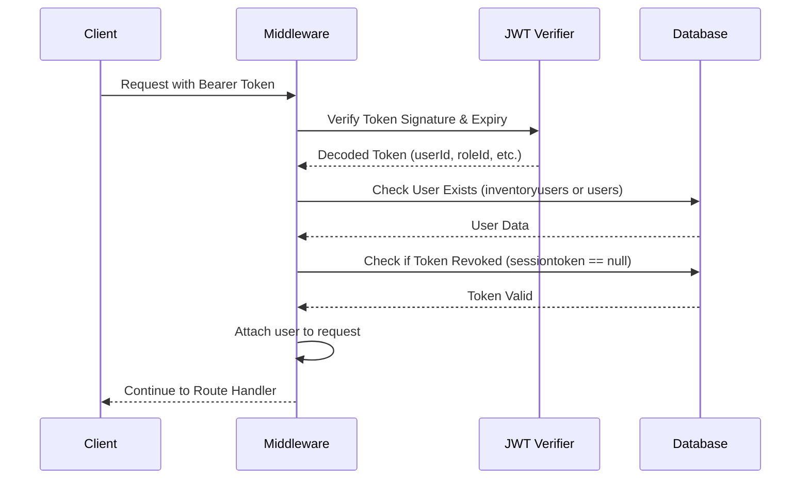
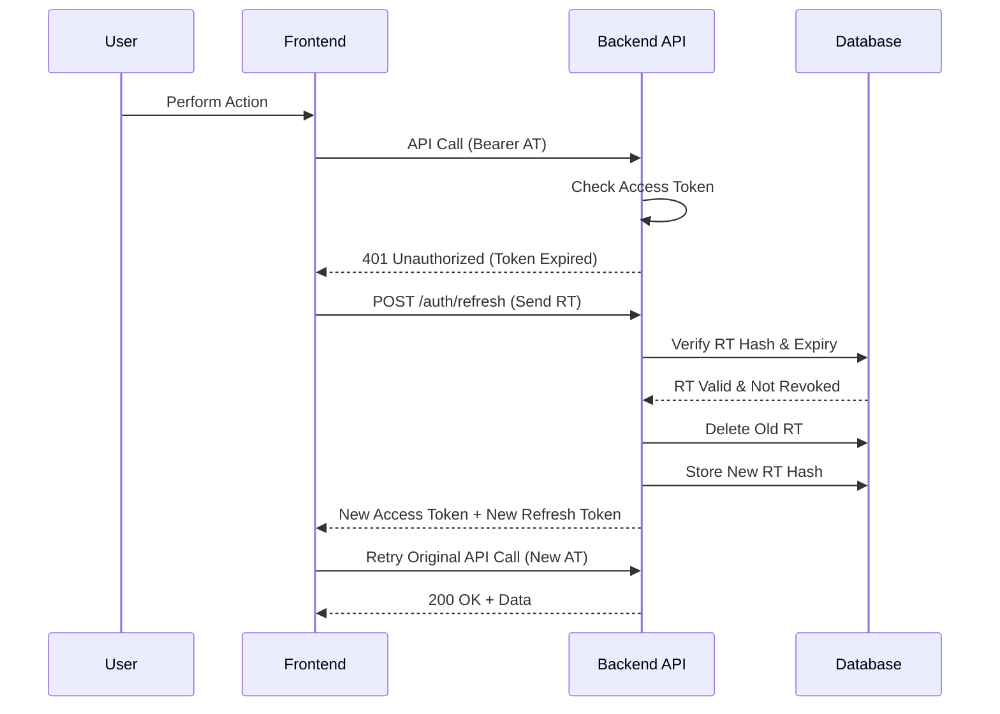

# 🔐 Authentication & Authorization System Design

## Executive Summary

This document outlines the authentication and authorization architecture for a **multi-application backend** serving both **Inventory Management** and **E-Commerce** applications. The system implements a **Hybrid JWT + Session** approach to provide both stateless performance and stateful control.

---

## 1. System Architecture Overview

### 1.1 Authentication Strategy

The system uses a **Hybrid JWT + Session** approach:

- **JWTs (JSON Web Tokens)**: Provide stateless authorization for API performance and scalability
- **Database Sessions**: Provide stateful control with the ability to revoke tokens immediately
- **Dual User Support**: Handles both inventory users (internal) and e-commerce users (customers)

### 1.2 User Types

| User Type | Table | Auth Method | Use Case |
|-----------|-------|-------------|----------|
| **Inventory Users** | `inventoryusers` | Email + Password | Internal staff, admins, warehouse workers |
| **E-Commerce Users** | `users` | Phone + OTP | Customers shopping on e-commerce platform |

---

## 2. Database Schema

### 2.1 Proposed: `auth_sessions` Table

> [!IMPORTANT]
> This table needs to be created to implement the full session management strategy.

| Column | Type | Description |
|--------|------|-------------|
| `id` | UUID | Primary key (also used as `sid` in JWT) |
| `user_id` | INTEGER | Foreign key to `users` or `inventoryusers` |
| `user_type` | ENUM | `'ecommerce'` or `'inventory'` |
| `refresh_token_hash` | TEXT | Hashed version of the refresh token |
| `expires_at` | DATETIME | 7 days for Inventory; 90 days for E-commerce |
| `is_revoked` | BOOLEAN | Default: `false`. Immediate kill-switch for token revocation |
| `ip_address` | VARCHAR | Last known IP address for security auditing |
| `user_agent` | TEXT | Device/Browser information |
| `created_at` | DATETIME | Session creation timestamp |
| `updated_at` | DATETIME | Last session update timestamp |

**Indexes:**
- Primary key on `id`
- Index on `user_id` for fast user session lookups
- Index on `refresh_token_hash` for token verification
- Composite index on `(user_id, user_type, is_revoked)` for efficient queries

---

## 3. Token Strategy

### 3.1 Access Token (JWT)

| Property | Value |
|----------|-------|
| **Lifetime** | 15 minutes |
| **Storage** | Frontend memory (state management) |
| **Purpose** | Bearer token for API authorization |
| **Transport** | `Authorization: Bearer <token>` header |

**JWT Payload Structure:**
```json
{
  "userId": 123,
  "role": "admin",
  "roleId": 5,
  "userType": "inventory",
  "sessionId": "uuid-v4",
  "iss": "asset-management-api",
  "aud": "asset-management-client",
  "sub": "user-123",
  "iat": 1234567890,
  "exp": 1234568790
}
```

### 3.2 Refresh Token

| Property | Inventory Users | E-Commerce Users |
|----------|----------------|------------------|
| **Lifetime** | 7 days (hard expiry) | 90 days (inactivity expiry) |
| **Storage (Web)** | HttpOnly, Secure, SameSite=Strict Cookie | HttpOnly, Secure, SameSite=Strict Cookie |
| **Storage (Mobile)** | Secure Keychain / Encrypted SharedPreferences | Secure Keychain / Encrypted SharedPreferences |
| **Rotation** | On every refresh | On every refresh |

> [!NOTE]
> Refresh token rotation prevents replay attacks. Each time a refresh token is used, the old one is invalidated and a new one is issued.

---

## 4. API Endpoints

### 4.1 Inventory Authentication

#### **POST** `/v1/auth/signin`

**Request:**
```json
{
  "useremail": "admin@example.com",
  "userpassword": "SecurePassword123!"
}
```

**Success Response (200):**
```json
{
  "success": true,
  "data": {
    "user": {
      "id": 1,
      "useremail": "admin@example.com",
      "firstname": "John",
      "lastname": "Doe",
      "role": "admin",
      "location": "Warehouse A",
      "roleid": 5
    },
    "roles": {
      "id": 5,
      "name": "Administrator",
      "code": "ADMIN",
      "level": 1
    },
    "permissions": {
      "orders": {
        "read": true,
        "create": true,
        "edit": true,
        "delete": true
      },
      "inventory": {
        "read": true,
        "create": true,
        "edit": true
      }
    },
    "token": "eyJhbGciOiJIUzI1NiIsInR5cCI6IkpXVCJ9...",
    "refreshToken": "eyJhbGciOiJIUzI1NiIsInR5cCI6IkpXVCJ9...",
    "expiresIn": 900
  },
  "message": "Sign-in successful"
}
```

**Error Responses:**
- `401`: Invalid credentials
- `429`: Too many sign-in attempts (rate limited)
- `500`: Server error

---

#### **POST** `/v1/auth/register`

**Request:**
```json
{
  "useremail": "newuser@example.com",
  "userpassword": "SecurePassword123!",
  "firstname": "Jane",
  "lastname": "Smith",
  "role": "warehouse_staff",
  "location": "Warehouse B"
}
```

**Success Response (201):**
Returns same structure as `/signin` (user is automatically authenticated after registration)

**Error Responses:**
- `409`: Email already exists
- `400`: Invalid password or validation error
- `429`: Too many registration attempts

---

#### **POST** `/v1/auth/signout`

**Headers:**
```
Authorization: Bearer <access_token>
```

**Success Response (200):**
```json
{
  "success": true,
  "message": "Sign-out successful"
}
```

> [!NOTE]
> This endpoint sets the `sessiontoken` to `null` in the database, effectively revoking all tokens for the user.

---

#### **POST** `/v1/auth/refresh`

**Request:**
```json
{
  "refreshToken": "eyJhbGciOiJIUzI1NiIsInR5cCI6IkpXVCJ9..."
}
```

**Success Response (200):**
```json
{
  "success": true,
  "data": {
    "token": "eyJhbGciOiJIUzI1NiIsInR5cCI6IkpXVCJ9...",
    "refreshToken": "eyJhbGciOiJIUzI1NiIsInR5cCI6IkpXVCJ9...",
    "expiresIn": 900
  }
}
```

> [!IMPORTANT]
> The old refresh token is invalidated and a new one is issued (token rotation).

---

### 4.2 E-Commerce Authentication

#### **POST** `/v1/auth/ecom/request-otp`

**Request:**
```json
{
  "phonenumber": "+919876543210"
}
```

**Success Response (200):**
```json
{
  "success": true,
  "message": "OTP sent successfully",
  "data": {
    "expires_in": 300
  }
}
```

---

#### **POST** `/v1/auth/ecom/verify-otp`

**Request:**
```json
{
  "phonenumber": "+919876543210",
  "otp": "123456"
}
```

**Success Response (200):**
```json
{
  "success": true,
  "data": {
    "user": {
      "id": 101,
      "firstname": "Suresh",
      "phonenumber": "+919876543210",
      "isbusinessuser": false
    },
    "token": "eyJhbGciOiJIUzI1NiIsInR5cCI6IkpXVCJ9...",
    "refreshToken": "eyJhbGciOiJIUzI1NiIsInR5cCI6IkpXVCJ9...",
    "expiresIn": 900
  }
}
```

> [!NOTE]
> For web clients, the refresh token is also set via `Set-Cookie` header.

---

## 5. Middleware System

### 5.1 Current Implementation Status

✅ **Implemented:**
- [x] `requireAuthentication` - Global auth middleware
- [x] `authenticateInventoryUser` - Alias for inventory user auth
- [x] `optionalAuthentication` - Auth without failing if no token
- [x] `requireRole(roles[])` - Role-based authorization
- [x] `requireAdmin` - Admin-only access
- [x] `requireManager` - Manager or higher access
- [x] `requireSelfOrAdmin` - Self or admin access

### 5.2 Authentication Flow



### 5.3 Middleware Logic

**`requireAuthentication` Middleware:**

1. **Extract Token**: From `Authorization: Bearer <token>` header or `?token=<token>` query parameter
2. **Rate Limiting**: Check if IP/token is rate-limited
3. **Verify JWT**: Validate signature, expiration, and structure
4. **Lookup User**: 
   - Try `inventoryusers` table first
   - If not found, try `users` table (e-commerce)
5. **Check Revocation**: For inventory users, verify `sessiontoken` is not null
6. **Attach User**: Set `request.user` with sanitized user data and metadata

**Request Object After Auth:**
```typescript
request.user = {
  id: number,
  useremail: string,
  role?: string,
  firstname?: string,
  lastname?: string,
  roleId?: number,
  userType: 'inventory' | 'ecommerce'
}
```

---

## 6. Route Protection Configuration

### 6.1 Current Status

> [!WARNING]
> Route protection is **NOT YET CONFIGURED** for most endpoints. This needs to be completed.

### 6.2 Route Protection Strategy

Routes should be categorized into three groups:

#### **Public Routes** (No Authentication Required)
- `POST /v1/auth/signin` - Sign in
- `POST /v1/auth/register` - Registration
- `POST /v1/auth/ecom/request-otp` - Request OTP
- `POST /v1/auth/ecom/verify-otp` - Verify OTP
- `POST /v1/auth/forgot-password` - Password reset request
- `POST /v1/auth/reset-password` - Reset password with token
- `POST /v1/auth/refresh` - Refresh access token
- `GET /v1/health` - Health check
- `GET /docs` - API documentation

#### **Protected Routes** (Authentication Required)
All other routes require authentication via `requireAuthentication` middleware.

**Example Categories:**
- `/v1/products/*` - Product management
- `/v1/orders/*` - Order management
- `/v1/inventory/*` - Inventory operations
- `/v1/users/*` - User management
- `/v1/categories/*` - Category management

#### **Admin-Only Routes** (Authentication + Admin Role Required)
- `POST /v1/users` - Create new user
- `DELETE /v1/users/:id` - Delete user
- `PUT /v1/roles/:id` - Update roles
- `GET /v1/reports/admin/*` - Admin reports

### 6.3 Implementation Checklist

- [ ] Review all route files in `/src/routes`
- [ ] Add `preHandler: requireAuthentication` to protected routes
- [ ] Add `preHandler: [requireAuthentication, requireAdmin]` to admin routes
- [ ] Add `preHandler: [requireAuthentication, requireRole(['admin', 'manager'])]` to manager routes
- [ ] Test all endpoints with and without tokens
- [ ] Document which routes are public vs protected

---

## 7. Security Features

### 7.1 Implemented Security Measures

✅ **Current Security Features:**

1. **Password Hashing**: Bcrypt with salt rounds
2. **JWT Secret**: Environment-based secret key
3. **Rate Limiting**: 
   - Sign-in attempts (5 attempts per 15 minutes)
   - Registration attempts
   - Password reset requests
   - Authentication middleware checks
4. **Token Expiry**: Short-lived access tokens (15 min)
5. **Token Revocation**: Session tokens can be revoked via signout
6. **Sanitized User Data**: Password fields removed from responses
7. **Detailed Logging**: Security events logged with IP, user agent, etc.
8. **HTTPS Enforcement**: Should be enabled in production

### 7.2 Additional Security Recommendations

> [!CAUTION]
> The following security measures should be implemented before production deployment:

#### Session Management
- [ ] Create `auth_sessions` table
- [ ] Implement refresh token rotation
- [ ] Store hashed refresh tokens (SHA-256)
- [ ] Track IP address and user agent
- [ ] Implement session limits per user

#### Token Security
- [ ] Add token fingerprinting
- [ ] Implement token blacklist/whitelist
- [ ] Add `jti` (JWT ID) claim for tracking
- [ ] Implement CSRF protection for web clients

#### OTP Security (E-Commerce)
- [ ] Limit OTP attempts (3 attempts per phone number)
- [ ] Implement OTP expiry (5 minutes)
- [ ] Add phone number verification
- [ ] Rate limit OTP requests per IP

#### Headers & CORS
- [ ] Configure security headers (helmet.js)
- [ ] Set strict CORS policy
- [ ] Enable HSTS (HTTP Strict Transport Security)
- [ ] Configure CSP (Content Security Policy)

#### Monitoring & Auditing
- [ ] Log all authentication events
- [ ] Alert on suspicious activities
- [ ] Track failed login attempts
- [ ] Monitor token usage patterns

---

## 8. Token Lifecycle Management

### 8.1 Token Expiry & Refresh Strategy

| Event | Access Token | Refresh Token | Action |
|-------|--------------|---------------|--------|
| **Login** | Issue 15min | Issue 7d (Inv) / 90d (Ecom) | Store refresh token hash in DB |
| **API Call** | Validate | - | Check expiry and revocation |
| **Token Expires** | Invalid | Valid | Frontend calls `/auth/refresh` |
| **Refresh** | Issue new 15min | Issue new 7d/90d | Delete old RT, store new RT |
| **Logout** | Revoked | Revoked | Set `is_revoked = true` |
| **Password Reset** | Revoked | Revoked | Invalidate all sessions |

### 8.2 Refresh Flow Diagram



---

## 9. Error Handling

### 9.1 Authentication Error Codes

| Status Code | Error | Description | User Action |
|-------------|-------|-------------|-------------|
| `401` | `AUTHENTICATION_REQUIRED` | No token provided | Redirect to login |
| `401` | `INVALID_TOKEN` | Token signature invalid | Redirect to login |
| `401` | `TOKEN_EXPIRED` | Access token expired | Refresh token |
| `401` | `TOKEN_REVOKED` | User signed out | Redirect to login |
| `401` | `USER_NOT_FOUND` | User deleted or doesn't exist | Redirect to login |
| `403` | `INSUFFICIENT_PERMISSIONS` | User lacks required role | Show error message |
| `429` | `RATE_LIMIT_EXCEEDED` | Too many attempts | Wait and retry |
| `500` | `AUTH_ERROR` | Server error during auth | Contact support |

### 9.2 Error Response Format

```json
{
  "success": false,
  "message": "Authentication required",
  "details": "Please provide a valid Bearer token",
  "statusCode": 401,
  "tokenStatus": "missing",
  "suggestion": "Please sign in to continue"
}
```

---

## 10. Multi-Application Support

### 10.1 User Type Detection

The system automatically detects user type during authentication:

1. **JWT Decoding**: Extract `userId`
2. **Database Lookup**: 
   - Query `inventoryusers` WHERE `id = userId`
   - If not found, query `users` WHERE `id = userId`
3. **Set User Type**: `userType = 'inventory'` or `userType = 'ecommerce'`
4. **Attach to Request**: `request.user.userType`

### 10.2 Application-Specific Logic

Different applications can implement different authorization rules:

**Inventory Application:**
- Check `userType === 'inventory'`
- Verify role-based permissions (admin, manager, staff)
- Enforce location-based access control

**E-Commerce Application:**
- Check `userType === 'ecommerce'`
- Implement user tier logic (regular, business user)
- Enable order history and profile management

---

## 11. Database Migration

### 11.1 SQL Migration Script for `auth_sessions`

```sql
-- Create auth_sessions table
CREATE TABLE IF NOT EXISTS auth_sessions (
  id UUID PRIMARY KEY DEFAULT gen_random_uuid(),
  user_id INTEGER NOT NULL,
  user_type VARCHAR(20) NOT NULL CHECK (user_type IN ('inventory', 'ecommerce')),
  refresh_token_hash TEXT NOT NULL,
  expires_at TIMESTAMP NOT NULL,
  is_revoked BOOLEAN DEFAULT FALSE,
  ip_address VARCHAR(45),
  user_agent TEXT,
  created_at TIMESTAMP DEFAULT CURRENT_TIMESTAMP,
  updated_at TIMESTAMP DEFAULT CURRENT_TIMESTAMP
);

-- Create indexes for performance
CREATE INDEX idx_auth_sessions_user ON auth_sessions(user_id, user_type);
CREATE INDEX idx_auth_sessions_token_hash ON auth_sessions(refresh_token_hash);
CREATE INDEX idx_auth_sessions_revoked ON auth_sessions(user_id, user_type, is_revoked);
CREATE INDEX idx_auth_sessions_expires ON auth_sessions(expires_at);

-- Create trigger to update updated_at
CREATE OR REPLACE FUNCTION update_auth_sessions_updated_at()
RETURNS TRIGGER AS $$
BEGIN
  NEW.updated_at = CURRENT_TIMESTAMP;
  RETURN NEW;
END;
$$ LANGUAGE plpgsql;

CREATE TRIGGER auth_sessions_updated_at
BEFORE UPDATE ON auth_sessions
FOR EACH ROW
EXECUTE FUNCTION update_auth_sessions_updated_at();

-- Clean up expired sessions periodically (optional job)
CREATE OR REPLACE FUNCTION cleanup_expired_sessions()
RETURNS void AS $$
BEGIN
  DELETE FROM auth_sessions 
  WHERE expires_at < CURRENT_TIMESTAMP 
  OR is_revoked = TRUE AND updated_at < CURRENT_TIMESTAMP - INTERVAL '30 days';
END;
$$ LANGUAGE plpgsql;
```

---

## 12. Implementation Roadmap

### 12.1 Phase 1: Session Management (Pending) ⏳

- [ ] Create `auth_sessions` table with migration script
- [ ] Implement session creation in `/signin` and `/verify-otp` endpoints
- [ ] Add refresh token hashing (SHA-256)
- [ ] Update `/refresh` endpoint to use database sessions
- [ ] Implement token rotation logic
- [ ] Add session cleanup job

### 12.2 Phase 2: Route Protection (Pending) 🔒

- [ ] Audit all routes in `/src/routes`
- [ ] Categorize routes (public, protected, admin-only)
- [ ] Add `preHandler` middleware to protected routes
- [ ] Create route protection matrix documentation
- [ ] Test all protected routes
- [ ] Update API documentation

### 12.3 Phase 3: E-Commerce OTP (Pending) 📱

- [ ] Implement OTP generation service
- [ ] Add OTP storage (Redis or database)
- [ ] Create `/auth/ecom/request-otp` endpoint
- [ ] Create `/auth/ecom/verify-otp` endpoint
- [ ] Add OTP rate limiting
- [ ] Integrate SMS provider (e.g., Twilio)

### 12.4 Phase 4: Security Hardening (Recommended) 🛡️

- [ ] Add security headers (Helmet.js)
- [ ] Configure strict CORS policy
- [ ] Implement CSRF protection
- [ ] Add token fingerprinting
- [ ] Set up security monitoring
- [ ] Conduct security audit

---

## 13. Testing Checklist

### 13.1 Authentication Tests

- [ ] Sign in with valid credentials (inventory)
- [ ] Sign in with invalid credentials (expect 401)
- [ ] Rate limiting on failed sign-in attempts
- [ ] Registration with new email
- [ ] Registration with existing email (expect 409)
- [ ] Sign out and verify token revocation
- [ ] Refresh token successfully
- [ ] Refresh with expired token (expect 401)
- [ ] Access protected route without token (expect 401)
- [ ] Access protected route with valid token (expect 200)

### 13.2 Authorization Tests

- [ ] Admin accessing admin-only route (expect 200)
- [ ] Non-admin accessing admin-only route (expect 403)
- [ ] User accessing their own resource (expect 200)
- [ ] User accessing another user's resource (expect 403)
- [ ] Manager accessing manager route (expect 200)

### 13.3 E-Commerce Tests

- [ ] Request OTP with valid phone number
- [ ] Verify OTP with correct code
- [ ] Verify OTP with incorrect code (expect 401)
- [ ] OTP expiry after 5 minutes
- [ ] Rate limiting on OTP requests

---

## 14. Configuration

### 14.1 Environment Variables

```env
# JWT Configuration
JWT_SECRET=your-super-secret-jwt-key-change-in-production
JWT_ACCESS_EXPIRY=15m
JWT_REFRESH_EXPIRY_INVENTORY=7d
JWT_REFRESH_EXPIRY_ECOMMERCE=90d

# Session Configuration
SESSION_CLEANUP_INTERVAL=1h
MAX_SESSIONS_PER_USER=5

# Rate Limiting
RATE_LIMIT_SIGNIN_MAX=5
RATE_LIMIT_SIGNIN_WINDOW=15m
RATE_LIMIT_OTP_MAX=3
RATE_LIMIT_OTP_WINDOW=5m

# Security
BCRYPT_SALT_ROUNDS=10
HTTPS_ONLY=true
CORS_ORIGIN=https://yourdomain.com

# OTP Configuration (for E-Commerce)
OTP_LENGTH=6
OTP_EXPIRY=300
SMS_PROVIDER=twilio
TWILIO_ACCOUNT_SID=your-account-sid
TWILIO_AUTH_TOKEN=your-auth-token
TWILIO_PHONE_NUMBER=+1234567890
```

---

## 15. API Documentation

All authentication endpoints are documented in Swagger/OpenAPI format and available at:

```
GET /docs
```

Interactive API testing available at:

```
GET /docs/static/index.html
```

---

## Next Steps

1. **Review this plan** and provide feedback
2. **Create the `auth_sessions` table** using the migration script
3. **Audit and protect routes** by adding authentication middleware
4. **Implement session management** with refresh token rotation
5. **Test thoroughly** using the testing checklist
6. **Deploy to staging** for integration testing
7. **Conduct security audit** before production release

---

## Questions for Stakeholders

1. Do we need to support multiple concurrent sessions per user, or should login from a new device invalidate old sessions?
2. What SMS provider should we use for OTP delivery (Twilio, AWS SNS, etc.)?
3. Should we implement email verification for inventory users during registration?
4. Do we need two-factor authentication (2FA) for admin users?
5. What session expiry is appropriate for e-commerce users (currently set to 90 days)?

---

**Last Updated**: December 25, 2024  
**Document Version**: 2.0  
**Status**: Implementation in Progress