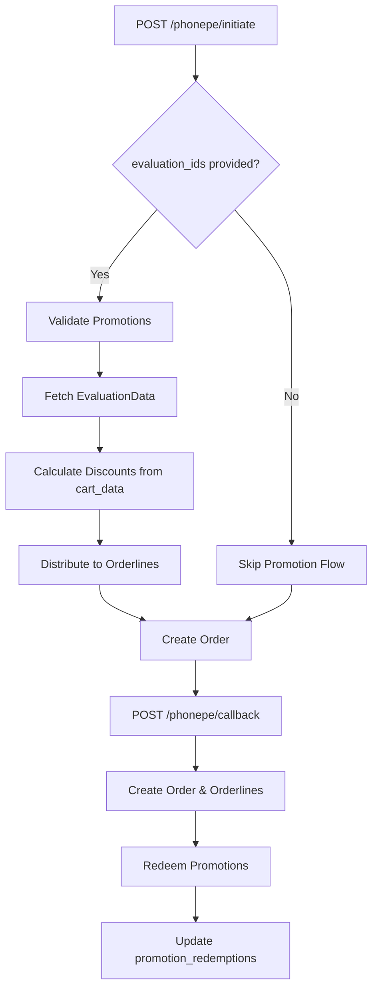

# PhonePe Promotion Flow - Complete Guide

## 📋 Overview

This document provides a comprehensive guide to how promotions (coupons/discounts) work in the PhonePe payment flow, covering:
- Promotion validation during payment initiation
- Discount calculation and distribution
- Promotion redemption in callback
- Impact on order and orderline fields

---

## 🔄 Promotion Flow Overview



---

## 📍 INITIATION FLOW (/v1/phonepe/initiate)

### Step 1: Promotion Validation

**When**: Request includes `evaluation_ids` array  
**Service**: `PromotionEvaluationService`  
**Method**: `validateEvaluationForOrder(evaluationId, userId)`

#### Validation Checks

```typescript
for each evaluation_id in evaluation_ids:
  1. Fetch evaluation record from promotion_evaluations table
  2. Check if expired → BLOCK ORDER (400 error)
  3. Check if cancelled → BLOCK ORDER (400 error)
  4. Check usage limit:
     - If promotion.max_uses_per_user reached → SKIP this promo
     - Otherwise → Add to validEvaluations[]
```

#### Validation Results

- **validEvaluations[]**: Promotions that can be applied
- **invalidEvaluations[]**: Expired/cancelled (blocks order)
- **limitReached[]**: Usage limit reached (skipped, order continues)

#### Example

```json
// Request
{
  "evaluation_ids": ["eval_123", "eval_456"],
  "order": [...],
  "transaction": {...}
}

// Validation Result
{
  "validEvaluations": ["eval_123"],      // Can be applied
  "invalidEvaluations": [],               // Would block order
  "limitReached": ["eval_456"]            // Skipped
}
```

---

### Step 2: Fetch Evaluation Data

**When**: validEvaluations not empty  
**Service**: `PromotionEvaluationService`  
**Method**: `getEvaluation(evaluationId)`

#### Evaluation Data Structure

```typescript
{
  evaluation_id: string,
  user_id: number,
  promotion_id: number,
  status: 'pending' | 'redeemed' | 'expired' | 'cancelled',
  
  // Cart data at time of evaluation
  cart_data: [
    {
      product_id: number,
      quantity: number,
      base_price: number,        // ⚠️ PER-UNIT original price
      product_discount: number,  // ⚠️ PER-UNIT product discount
      // ... other product details
    }
  ],
  
  // Promotion breakdown
  applied_promotions: [
    {
      promotion_id: number,
      promotion_code: string,
      promotion_type: 'percentage' | 'flat' | 'buy_x_get_y',
      total_discount: number,    // Total promotion discount
      
      // Per-product breakdown (if available)
      breakdown: [
        {
          product_id: number,
          discount: number,       // Promotion discount for this product
          total_discount: number  // Total for this product (disc × qty)
        }
      ]
    }
  ],
  
  // Totals from evaluation
  total_amount: number,
  discount_amount: number,
  final_amount: number
}
```

---

### Step 3: Calculate Totals from Evaluation

**Location**: `phonepe.controller.ts` - `createOrderAfterPayment()`

#### Calculate Original Total

```typescript
originalTotal = cart_data.reduce((total, item) => {
  return total + (item.base_price × item.quantity);
}, 0);

// Example:
// Product 1: ₹150 × 2 = ₹300
// Product 2: ₹100 × 1 = ₹100
// originalTotal = ₹400
```

#### Calculate Product Discount Total

```typescript
productDiscountTotal = cart_data.reduce((total, item) => {
  return total + (item.product_discount × item.quantity);
}, 0);

// Example:
// Product 1: ₹10 × 2 = ₹20
// Product 2: ₹0 × 1 = ₹0
// productDiscountTotal = ₹20
```

#### Calculate Promotion Discount Total

```typescript
promotionDiscountTotal = applied_promotions.reduce((total, promo) => {
  return total + promo.total_discount;
}, 0);

// Example:
// Promo 1 (FLAT50): ₹50
// promotionDiscountTotal = ₹50
```

---

### Step 4: Enrich Order Items with Discount Data

**Purpose**: Distribute discounts to individual orderlines

#### PATH A: Using Evaluation Data (Recommended)

```typescript
for each item in order:
  productId = item.productid
  quantity = item.quantity
  
  // 1. Get base price from cart_data
  cartItem = cart_data.find(c => c.product_id === productId)
  originalPrice = cartItem.base_price              // ⚠️ PER-UNIT
  
  // 2. Calculate product discount
  productDiscountPerUnit = cartItem.product_discount
  productDiscountAmount = productDiscountPerUnit × quantity  // TOTAL
  
  // 3. Calculate item product amount
  itemProductAmount = (originalPrice × quantity) - productDiscountAmount
  
  // 4. Get promotion discount from breakdown
  if (promotion.breakdown exists):
    // Use exact breakdown
  breakdownItem = breakdown.find(b => b.product_id === productId)
    promotionDiscountAmount = breakdownItem.total_discount  // TOTAL
  else:
    // Pro-rata distribution
    totalProductAmount = Σ(all items productAmount)
    proRataFactor = itemProductAmount / totalProductAmount
    promotionDiscountAmount = promotionDiscountTotal × proRataFactor
  
  // 5. Calculate shipping (pro-rata)
  shippingCostForItem = (totalShipping × itemProductAmount) / totalProductAmount
  
  // 6. Calculate final amounts
  discountamount = productDiscountAmount + promotionDiscountAmount
  orderamount = itemProductAmount - promotionDiscountAmount
```

#### PATH B: No Evaluation Data (Fallback)

```typescript
for each item in order:
  // Extract from request payload
  rawProductAmount = item.productamount   // ⚠️ ORIGINAL price PER-UNIT
  rawDiscountAmount = item.discountamount // TOTAL product discount
  quantity = item.quantity
  
  // Calculate amounts
  originalPrice = rawProductAmount                           // PER-UNIT
  productDiscountAmount = rawDiscountAmount                  // TOTAL
  itemProductAmount = (rawProductAmount × quantity) - rawDiscountAmount
  promotionDiscountAmount = 0  // No promotions
  
  // Rest same as PATH A
```

#### Example Calculation

**Scenario**: 2 products with 20% off coupon

```
Product 1: ₹150 base, ₹10 product discount, qty=2
Product 2: ₹100 base, ₹0 product discount, qty=1
Promotion: 20% off (PERCENT20)
Shipping: ₹50

// Step 1: Calculate product amounts
Item 1: (150 × 2) - (10 × 2) = ₹280
Item 2: (100 × 1) - 0 = ₹100
Total Product Amount = ₹380

// Step 2: Calculate promotion discount
Total Promotion = 20% of ₹380 = ₹76

// If breakdown provided:
Item 1: ₹60 (from breakdown)
Item 2: ₹16 (from breakdown)

// If no breakdown (pro-rata):
Item 1: ₹76 × (280/380) = ₹56
Item 2: ₹76 × (100/380) = ₹20

// Step 3: Calculate shipping (pro-rata)
Item 1: ₹50 × (280/380) = ₹36.84
Item 2: ₹50 × (100/380) = ₹13.16

// Step 4: Final amounts
Item 1:
  original_price: ₹150 (PER-UNIT)
  product_discount_amount: ₹20 (TOTAL)
  productamount: ₹280 (TOTAL after product discount)
  promotion_discount_amount: ₹60 (TOTAL)
  orderamount: ₹220 (TOTAL, excludes shipping)
  shipping_cost: ₹36.84
  
Item 2:
  original_price: ₹100 (PER-UNIT)
  product_discount_amount: ₹0
  productamount: ₹100
  promotion_discount_amount: ₹16
  orderamount: ₹84
  shipping_cost: ₹13.16
```

---

## 📍 CALLBACK FLOW (/v1/phonepe/callback)

### Step 1: Create Order & Orderlines

**When**: Payment successful  
**Data Source**: enrichedOrderItems from initiation

#### Order Fields (Promotion-Related)

```typescript
{
  productamount: Σ(orderline.productamount),        // After product discounts
  discountamount: productDiscountTotal + promotionDiscountTotal,
  promotion_discount_total: promotionDiscountTotal,
  evaluation_id: primaryEvaluationId,
  // ... other fields
}
```

#### Orderline Fields (Promotion-Related)

```typescript
{
  original_price: number,              // ⚠️ PER-UNIT base price
  product_discount_amount: number,     // TOTAL product discount
  promotion_discount_amount: number,   // TOTAL promotion discount
  productamount: number,               // TOTAL after product discount
  discountamount: number,              // TOTAL (product + promotion)
  orderamount: number,                 // TOTAL final (excludes shipping)
  evaluation_id: string,               // Links to promotion_evaluations
  // ... other fields
}
```

---

### Step 2: Update Orderlines with Exact Discounts

**Purpose**: Ensure accurate discount distribution and handle rounding

**Location**: After orderline creation, before redemption

```typescript
// Get evaluation data again
evaluationCartData = evaluationData.cart_data
appliedPromotions = evaluationData.applied_promotions

// Create discount maps
originalPriceMap = new Map()
productDiscountMap = new Map()

// Populate from evaluationData OR fallback to request
if (evaluationCartData exists):
  for each cartItem in evaluationCartData:
    originalPriceMap.set(productId, cartItem.base_price)        // PER-UNIT
    productDiscountMap.set(productId, cartItem.product_discount) // PER-UNIT
else:
  // Fallback to request payload
  for each orderItem in request.order:
    originalPriceMap.set(productId, orderItem.productamount)     // PER-UNIT
    productDiscountMap.set(productId, orderItem.discountamount / quantity) // PER-UNIT

// Update each orderline with exact values
for each orderline:
  originalPricePerItem = originalPriceMap.get(productId)
  productDiscountPerItem = productDiscountMap.get(productId)
  
  // Calculate totals for this line
  productDiscountAmount = productDiscountPerItem × quantity
  // ... update orderline in database
```

---

### Step 3: Promotion Redemption

**When**: Order created successfully  
**Service**: `PromotionRedemptionService`  
**Method**: `redeemPromotion()`

#### Redemption Process

```typescript
for each evaluationId in validEvaluations:
  try {
    await redeemPromotion({
      evaluation_id: evaluationId,
      order_id: order.id,
      user_id: transaction.userid
    });
    
    // Creates record in promotion_redemptions table:
    {
      evaluation_id: string,
      order_id: number,
      user_id: number,
      redeemed_at: timestamp,
      discount_amount: number,
      // ... other fields
    }
    
    // Updates promotion_evaluations:
    {
      status: 'redeemed',
      redeemed_at: timestamp
    }
    
  } catch (error) {
    // Log error but don't fail order
    // Order remains but promotion not marked as redeemed
  }
}
```

#### Redemption Failure Handling

- **If redemption fails**: Order is still created, but promotion not marked as used
- **Reason**: Order creation is primary, promotion is secondary
- **Mitigation**: Log for manual review/retry

---

## 📊 Impact on Order & Orderline Fields

### Order-Level Impact

| Field | Without Promotion | With Promotion |
|-------|------------------|----------------|
| `productamount` | Σ(base × qty) - product_disc | Same |
| `discountamount` | product_disc_total | product_disc + promo_disc |
| `promotion_discount_total` | 0 | promo_disc_total |
| `orderamount` | productamount + shipping | productamount - promo_disc + shipping |
| `evaluation_id` | null | primary_evaluation_id |

### Orderline-Level Impact

| Field | Without Promotion | With Promotion |
|-------|------------------|----------------|
| `original_price` | base_price (PER-UNIT) | base_price (PER-UNIT) |
| `product_discount_amount` | product_disc × qty | product_disc × qty |
| `promotion_discount_amount` | 0 | promo_disc (from breakdown/pro-rata) |
| `productamount` | (base × qty) - product_disc | Same |
| `discountamount` | product_disc_amount | product_disc + promo_disc |
| `orderamount` | productamount | productamount - promo_disc |
| `evaluation_id` | null | evaluation_id |

---

## 🔑 Key Concepts

### Per-Unit vs Total

**⚠️ CRITICAL DISTINCTION:**

- **`original_price`**: Always PER-UNIT (not multiplied by quantity)
- **All discount amounts**: Always TOTAL for the line item (includes quantity)
- **`productamount`**: Always TOTAL after product discounts
- **`orderamount`**: Always TOTAL final amount (excludes shipping)

### Discount Distribution Methods

#### 1. Breakdown Method (Preferred)

When `applied_promotions[].breakdown` exists:
```typescript
promotionDiscountAmount = breakdown.find(productId).total_discount
```

**Advantages**:
- Exact discount per product
- No rounding errors
- Handles complex promotions (BOGO, tiered, etc.)

#### 2. Pro-Rata Method (Fallback)

When no breakdown available:
```typescript
proRataFactor = itemProductAmount / totalProductAmount
promotionDiscountAmount = promotionTotal × proRataFactor
```

**Advantages**:
- Works for any promotion type
- Fair distribution

**Disadvantages**:
- Rounding issues
- Less accurate for complex promotions

### Rounding Handling

```typescript
const roundToTwo = (value) => Math.round((value + Number.EPSILON) * 100) / 100

// For last item in list (to maintain total):
if (isLastLine) {
  promotionDiscountAmount = promotionTotal - accumulatedPromotion
}
```

---

## 🎯 Best Practices

### 1. Always Use Evaluation Data When Available

```typescript
// ✅ GOOD
if (evaluationData) {
  originalPrice = cartData.base_price
  productDiscount = cartData.product_discount
} else {
  // Fallback to request
}

// ❌ BAD  
originalPrice = request.productamount  // Ignores evaluation data
```

### 2. Store Evaluation ID in Orderlines

```typescript
// ✅ Enables tracking which promotion was used
orderlineData = {
  evaluation_id: primaryEvaluationId,
  promotion_discount_amount: discountAmount
}
```

### 3. Handle Redemption Failures Gracefully

```typescript
// ✅ GOOD
try {
  await redeemPromotion(...)
} catch (error) {
  logger.error("Redemption failed but order created")
  // Don't throw - order is more important
}

// ❌ BAD
await redeemPromotion(...)  // Would fail entire order
```

### 4. Validate Totals Match

```typescript
// Validate enriched totals match order totals
const enrichedTotal = enrichedItems.reduce((sum, item) => 
  sum + item.orderamount, 0
)
const orderTotal = order.orderamount - order.shipping_cost

if (Math.abs(enrichedTotal - orderTotal) > 0.01) {
  logger.warn("Total mismatch detected")
}
```

---

## 📝 Database Tables

### promotion_evaluations

```sql
CREATE TABLE promotion_evaluations (
  evaluation_id VARCHAR PRIMARY KEY,
  user_id INT,
  promotion_id INT,
  status VARCHAR,  -- 'pending', 'redeemed', 'expired', 'cancelled'
  cart_data JSONB,  -- Cart snapshot at evaluation time
  applied_promotions JSONB,  -- Promotion details and breakdown
  total_amount DECIMAL,
  discount_amount DECIMAL,
  final_amount DECIMAL,
  created_at TIMESTAMP,
  redeemed_at TIMESTAMP,
  expires_at TIMESTAMP
);
```

### promotion_redemptions

```sql
CREATE TABLE promotion_redemptions (
  id SERIAL PRIMARY KEY,
  evaluation_id VARCHAR REFERENCES promotion_evaluations,
  order_id INT REFERENCES orders,
  user_id INT,
  discount_amount DECIMAL,
  redeemed_at TIMESTAMP
);
```

---

## 🔍 Troubleshooting

### Issue: Promotion not applied

**Checks**:
1. Verify `evaluation_ids` in request
2. Check evaluation status (not expired/cancelled)
3. Verify usage limit not reached
4. Check logs for validation errors

### Issue: Discount amounts don't match

**Checks**:
1. Verify using evaluation `cart_data`, not request
2. Check if breakdown exists vs pro-rata
3. Review rounding logic
4. Validate totals match between initiation and callback

### Issue: Redemption failed but order created

**This is expected behavior**:
- Order creation is primary
- Redemption is secondary
- Check logs and manually retry redemption if needed

---

## 📚 Related Documentation

- [ORDER_ORDERLINE_FIELDS_MASTER_REFERENCE.md](./ORDER_ORDERLINE_FIELDS_MASTER_REFERENCE.md)
- [PHONEPE_PAYMENT_IMPLEMENTATION_GUIDE.md](./PHONEPE_PAYMENT_IMPLEMENTATION_GUIDE.md)
