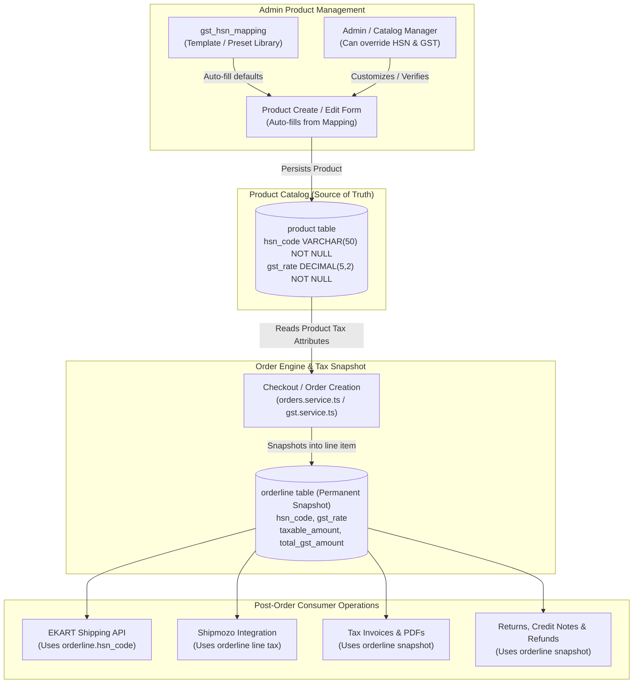

# Architecture & Migration Plan: Product-Level HSN Code and GST Rate

**Document ID:** `DOC-2026-09-30-HSN-GST-MIGRATION`  
**Date:** 2026-09-30  
**Status:** Implementation and configured DB product data verified; final database `NOT NULL` constraint application pending  
**Target Repositories:**  
- `asset-management-backend` (Prisma schema, dynamic DB ops, GST calculation, Orderline snapshots)
- `asset_management_frontend_aromazen` (Product create/update forms, validation, and auto-fill logic)
- `Nivaana-Ecom-Web` / `Vibrant-Life-mobile-app` (Read-only consumer of backend tax calculations)
**SQL Migration File:** [`scripts/migrations/20260930_add_product_hsn_gst_backfill.sql`](../../scripts/migrations/20260930_add_product_hsn_gst_backfill.sql)

---

## 1. Background & Problem Statement

Historically, the Nivaana platform derived HSN Code and GST rates dynamically using a category/subcategory taxonomy table (`gst_hsn_mapping`). 

### Limitations of Category-Level Mapping:
1. **Tax Discrepancies within Categories:** Products under the same category or subcategory often require different HSN codes or GST slabs (e.g., pure essential oils vs blended wellness oils, cosmetic vs medicinal preparations, varying liquid volumes or formulations).
2. **Combos & Gift Packs:** Multi-item sets (`iscombo: true`) represent composite or mixed supplies requiring their own specific HSN and tax treatment that category mapping cannot infer.
3. **Lack of Flexibility:** Store administrators could not override rates on specific SKUs without polluting the global category taxonomy.

### New Business Requirement:
- HSN Code and GST Rate belong directly to the **individual product**.
- Both fields are **mandatory** during product creation and updating.
- Category mapping (`gst_hsn_mapping`) is retained as a **smart default/template library** to auto-fill inputs in the admin UI, which the user can freely edit or override.
- Order creation must capture an **immutable tax snapshot** in `orderline` so historic orders, invoices, credit notes, and shipping manifests remain permanently unaffected by future product tax modifications.

---

## 2. Core Architecture & Data Flow



---

## 3. Impact Analysis & Core Design Questions

### Q1: Can we completely remove/deprecate the old category-level HSN/GST approach?
* **Deprecate as primary tax resolver:** **Yes.** `gst.service.ts` will no longer query `gst_hsn_mapping` as the primary lookup.
* **Keep as template provider:** **Yes.** We retain `gst_hsn_mapping` for admin UI auto-fill and migration assistance only. Order, invoice, return, and shipment runtime paths do not use it as a tax resolver.

### Q2: Do we need the existing `gst_hsn_mapping` at all after this change?
* **Yes.** It powers the auto-fill feature on the frontend when an admin picks a category/subcategory, speeding up catalog entry while allowing manual overrides.
* A mapping row is **optional**, not a prerequisite for product creation. If no preset matches, the HSN/GST fields remain available for mandatory manual entry and validation.
* An admin only needs to add a new mapping row when the same classification should be offered as an auto-fill preset for future products.

### Q3: Should HSN/GST be copied from the product into the order item when the order is created?
* **YES, ABSOLUTELY (MANDATORY).** 
* In compliance with Indian GST laws, once an order is placed, its tax rate and HSN code are legally binding. The `orderline` table already has dedicated snapshot columns:
  - `orderline.hsn_code`
  - `orderline.gst_rate`
  - `orderline.taxable_amount`
  - `orderline.cgst_amount`, `orderline.sgst_amount`, `orderline.igst_amount`, `orderline.total_gst_amount`
* Storing this at checkout ensures zero tax calculation drift if a product's tax slab changes in the future.

### Q4: Should shipment/invoice/tax calculations use the value stored in the order item?
* **YES.** All post-order operations strictly read from `orderline`:
  - **Invoices:** Itemized tax breakdown comes directly from `orderline`.
  - **EKART:** Reads `firstOrderline.hsn_code` ([`ekart.service.ts` line 523](file:///Users/sureshkumar/Documents/GitHub/Nivaana/asset-management-backend/src/services/ekart.service.ts#L523)).
  - **Shipmozo:** Uses `orderline` amounts and tax rates.
  - **Returns & Credit Notes:** [`return-request.service.ts`](file:///Users/sureshkumar/Documents/GitHub/Nivaana/asset-management-backend/src/services/return-request.service.ts) and [`invoice-adjustment.service.ts`](file:///Users/sureshkumar/Documents/GitHub/Nivaana/asset-management-backend/src/services/invoice-adjustment.service.ts) use `orderline.hsn_code` and `orderline.gst_rate`.

### Q5: What happens to existing products and existing orders?
* **Existing Orders:** Rows with complete orderline tax snapshots remain unchanged. Legacy rows missing snapshot fields require a separately reviewed repair process; normal runtime flows will not recalculate them from current product data.
* **Existing Products:**
  - Backfilled automatically from active `gst_hsn_mapping` rows using deterministic exact-subsubcategory-first matching.
  - Unmapped products must be explicitly classified. The migration aborts before applying `NOT NULL` while any product remains blank.
  - No artificial default fallbacks (`33074100` / `18%`) are injected into the database or forms.

---

## 4. Database Migration & Backfill Script

The migration is packaged in a standalone executable file:
👉 **[`scripts/migrations/20260930_add_product_hsn_gst_backfill.sql`](../../scripts/migrations/20260930_add_product_hsn_gst_backfill.sql)**

### SQL Execution Outline:
```sql
BEGIN;

-- 1. Add columns without default values
ALTER TABLE "product" 
  ADD COLUMN IF NOT EXISTS "hsn_code" VARCHAR(50),
  ADD COLUMN IF NOT EXISTS "gst_rate" DECIMAL(5, 2);

-- Ensure no hardcoded column defaults exist. Unmapped items must be explicitly
-- classified before this transaction can enforce NOT NULL and commit.
ALTER TABLE "product" 
  ALTER COLUMN "hsn_code" DROP DEFAULT,
  ALTER COLUMN "gst_rate" DROP DEFAULT;

-- 2. Backfill from gst_hsn_mapping where matches exist
UPDATE "product" p
SET 
  "hsn_code" = m.hsn_code,
  "gst_rate" = m.gst_rate
FROM "gst_hsn_mapping" m
WHERE (
    LOWER(TRIM(COALESCE(p.subcategory, ''))) = LOWER(TRIM(COALESCE(m.subcategory_value, '')))
    AND (
      m.subsubcategory_value IS NULL 
      OR LOWER(TRIM(COALESCE(p.subsubcategory, ''))) = LOWER(TRIM(COALESCE(m.subsubcategory_value, '')))
    )
  )
  AND (p.hsn_code IS NULL OR p.gst_rate IS NULL);

-- 3. Abort if any product remains blank; after explicit classification,
--    enforce NOT NULL on both product tax columns.

COMMIT;
```

---

## 5. Exhaustive Impact Matrix

### A. Backend Services (`asset-management-backend`)
| File | Component | Impact / Required Modifications |
| :--- | :--- | :--- |
| [`prisma/schema.prisma`](file:///Users/sureshkumar/Documents/GitHub/Nivaana/asset-management-backend/prisma/schema.prisma) | Schema Definition | Add required `hsn_code String @db.VarChar(50)` and `gst_rate Decimal @db.Decimal(5, 2)` fields without artificial defaults. |
| [`src/utils/dynamicDbOperations.ts`](file:///Users/sureshkumar/Documents/GitHub/Nivaana/asset-management-backend/src/utils/dynamicDbOperations.ts#L42-L75) | Whitelist Validation | Add `'hsn_code'` and `'gst_rate'` to `TABLE_COLUMNS.product` array to prevent silent dropping during insert/update. |
| [`src/schemas/product.schema.ts`](file:///Users/sureshkumar/Documents/GitHub/Nivaana/asset-management-backend/src/schemas/product.schema.ts) | Request Validation | Require `hsn_code` and a `gst_rate` from 0–100 on create. Update payloads remain partial, but the product service rejects any update whose effective product tax configuration is incomplete or invalid. |
| [`src/services/product.service.ts`](file:///Users/sureshkumar/Documents/GitHub/Nivaana/asset-management-backend/src/services/product.service.ts) | Product CRUD | Include `hsn_code` and `gst_rate` in create/update payloads and fetch select projections. |
| [`src/services/gst.service.ts`](file:///Users/sureshkumar/Documents/GitHub/Nivaana/asset-management-backend/src/services/gst.service.ts) | GST Calculation Engine | Calculate exclusively from the immutable `orderline.hsn_code` and `orderline.gst_rate` snapshot; reject incomplete snapshots. |
| [`src/services/orders.service.ts`](file:///Users/sureshkumar/Documents/GitHub/Nivaana/asset-management-backend/src/services/orders.service.ts) | Order Placement | Fetch `hsn_code` and `gst_rate` during orderline creation and write them to `orderline`. |
| [`src/services/instore-order.service.ts`](file:///Users/sureshkumar/Documents/GitHub/Nivaana/asset-management-backend/src/services/instore-order.service.ts) | In-Store POS Orders | Ensure POS orderline items capture product HSN and GST snapshot. |

### B. Shipping, Invoicing & Returns
| Integration | Impact Analysis | Action Required |
| :--- | :--- | :--- |
| **EKART Logistics** ([`ekart.service.ts`](file:///Users/sureshkumar/Documents/GitHub/Nivaana/asset-management-backend/src/services/ekart.service.ts#L523)) | Builds shipment tax identity only from valid, shippable orderline snapshots. | Reject missing/invalid snapshots and reject mixed-HSN orders because the EKART request supports one HSN value. |
| **Shipmozo** ([`shipmozo.controller.ts`](file:///Users/sureshkumar/Documents/GitHub/Nivaana/asset-management-backend/src/controllers/shipmozo.controller.ts)) | Rebuilds provider product details from persisted, shippable orderlines. | Ignore caller HSN/product tax identity and reject missing/invalid orderline snapshots. |
| **Tax Invoices** ([`orders.service.ts`](file:///Users/sureshkumar/Documents/GitHub/Nivaana/asset-management-backend/src/services/orders.service.ts#L360)) | Generates itemized GST tables. | **None.** Already renders from `orderline.hsn_code` and `orderline.gst_rate`. |
| **Returns & Credit Notes** ([`return-request.service.ts`](file:///Users/sureshkumar/Documents/GitHub/Nivaana/asset-management-backend/src/services/return-request.service.ts)) | Calculates reverse GST adjustments based on purchase-time rates. | **None.** Already uses `orderline.gst_rate` snapshot. |

### C. Admin Frontend Portal (`asset_management_frontend_aromazen`)
| File | Impact / Required Modifications |
| :--- | :--- |
| [`src/types/product.ts`](file:///Users/sureshkumar/Documents/GitHub/Nivaana/asset_management_frontend_aromazen/src/types/product.ts) | Add `hsn_code: string` and `gst_rate: number` to `Product`, `CreateProductData`, and `UpdateProductData`. |
| [`src/components/products/ProductCreate.tsx`](file:///Users/sureshkumar/Documents/GitHub/Nivaana/asset_management_frontend_aromazen/src/components/products/ProductCreate.tsx) | 1. Add mandatory HSN Code text input.<br>2. Add mandatory GST Rate select/input (0%, 5%, 12%, 18%, 28%).<br>3. Add auto-fill listener: when subcategory changes, auto-fill default values from `gst_hsn_mapping` while keeping inputs editable. |
| [`src/components/products/ProductDetail.tsx`](file:///Users/sureshkumar/Documents/GitHub/Nivaana/asset_management_frontend_aromazen/src/components/products/ProductDetail.tsx) | Display HSN Code and GST Rate in product specifications and enable editing. |
| [`src/components/products/ProductList.tsx`](file:///Users/sureshkumar/Documents/GitHub/Nivaana/asset_management_frontend_aromazen/src/components/products/ProductList.tsx) | Display HSN and GST badges in the inventory table. |

---

## 6. Implementation Steps & Rollout Strategy

1. **Step 1: Database Migration & Backfill**
   - Execute [`scripts/migrations/20260930_add_product_hsn_gst_backfill.sql`](../../scripts/migrations/20260930_add_product_hsn_gst_backfill.sql).
   - Explicitly classify every product that cannot be mapped, then verify all products have non-null `hsn_code` and `gst_rate`. The migration intentionally aborts otherwise.
2. **Step 2: Backend Prisma & Dynamic DB Updates**
   - Update `schema.prisma`.
   - Run `npx prisma generate`.
   - Add columns to `TABLE_COLUMNS.product` in `src/utils/dynamicDbOperations.ts`.
3. **Step 3: Backend Product & GST Service Integration**
   - Update product create/update validation and enforce the effective product tax configuration at the service boundary.
   - Update `gst.service.ts` to calculate exclusively from `orderline.gst_rate` and `orderline.hsn_code`.
   - Update `orders.service.ts` and `instore-order.service.ts` to snapshot values into `orderline`.
4. **Step 4: Frontend UI Updates**
   - Update TypeScript interfaces in `src/types/product.ts`.
   - Implement HSN and GST input fields and auto-fill in `ProductCreate.tsx`.
   - Implement view and edit controls in `ProductDetail.tsx`.
5. **Step 5: End-to-End Verification**
   - Create a product under `wellness` with a custom GST rate (e.g., 12% instead of 18%).
   - Place an order and inspect `orderline` record to verify the 12% rate is captured.
   - Verify EKART payload and invoice PDF generation.

---

## 7. Configured Database Rollout Record

### Product Data Remediation — 2026-09-30

The configured database was updated directly for the three intentionally unmapped subcategories below. This was a database-only data correction; no additional SQL script or `gst_hsn_mapping` record was created.

| Subcategory | Product HSN | Product GST | Rows Updated | Mapping Preset Required? |
| :--- | :--- | :--- | ---: | :--- |
| `everyday_perfumes` | `3307` | `18%` | 1 | No; manual product-level classification is valid |
| `luxury_gifts` | `4202` | `18%` | 1 | No; manual product-level classification is valid |
| `decor` | `4420` | `5%` | 12 | No; manual product-level classification is valid |

Post-update verification:

- Total products: **64**
- Products missing HSN/GST: **0**
- Existing non-null product tax values overwritten: **0**
- `gst_hsn_mapping` rows added or changed: **0**
- Database columns remain nullable until the final migration is rerun successfully; application validation already treats both fields as mandatory.

### Order Snapshot Verification

Order `NIVAANA-0000000377` was checked as a runtime example:

- Product `NIV-0076`: product and orderline both store `33074100 / 5%`.
- Product `KRA-0075`: product and orderline both store `73733 / 12%`.
- `KRA-0075` has no active `gst_hsn_mapping` preset for `incense_accessories`; this is expected and does not affect the saved order because the orderline contains the product-level snapshot.
- Shipment, invoice, return, and credit-note flows must continue using the saved orderline values rather than performing a runtime mapping lookup.
