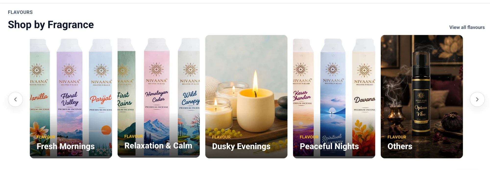

# Ecom Home Catalog API

**Date:** 2026-10-05  
**Status:** 🟡 Implemented; TypeScript and ESLint verified; awaiting local build/test and dev verification  
**Repositories:** `asset-management-backend`, `Nivaana-Ecom-Web`

---

## 1. Problem

The Ecom Home page loaded the first 100 platform products (`GET /v1/products/platform/nivapp?page=1&limit=100`, ordered by `modifieddate`) and built every product section in the browser:

| Section | Previous behaviour | Issue |
| :--- | :--- | :--- |
| Best Sellers | Sorted the 100 products by `soldquantity`, showed 8 | `soldquantity` counts sold units on all platforms (Amazon, Flipkart, Nivapp), not Nivapp; products outside the first 100 were never considered |
| New Arrivals | Sorted the 100 products by `createddate`, showed 10 | Newest products could be outside the first 100 (which are ordered by `modifieddate`) |
| Best of Nivaana | Score `sold + rating × 10 + 8 if discounted`, top 8 | Same 100-product limit and all-platform sold count |
| Flavours | Distinct `fragnancetype` values in the 100 products | Flavours present only outside the first 100 were missing |
| Category slides (fallback) | Distinct category/subcategory in the 100 products | Same limit |
| Review images (fallback) | Product image looked up in the 100 products | Same limit |

As the catalogue grows, every section becomes less accurate while the payload stays large.

---

## 2. Solution

A new read-only, public endpoint returns every Home section ranked by the database across the full catalogue:

```http
GET /v1/products/platform/nivapp/home
```

```json
{
  "success": true,
  "message": "Home catalog for nivapp platform retrieved successfully",
  "data": {
    "bestSellers":   [ /* up to 10 products */ ],
    "newArrivals":   [ /* up to 10 products */ ],
    "bestOfNivaana": [ /* up to 8 products */ ],
    "flavours":      [ { "value": "Rose", "large": [], "medium": [], "small": [] } ],
    "categories":    [ { "category": "Incense", "subcategory": "Sticks", "large": [], "medium": [], "small": [] } ]
  }
}
```

### 2.1 Section rules

| Section | Database rule | Limit |
| :--- | :--- | ---: |
| Best Sellers | `platformstock.soldqty DESC, productid ASC` for `platform = 'nivapp'` | 10 |
| New Arrivals | `product.createddate DESC NULLS LAST, id ASC` | 10 |
| Best of Nivaana | `(soldqty + averagerating × 10 + 8 when discount > 0) DESC, id ASC` | 8 |
| Flavours | Distinct trimmed, case-insensitive values of comma-separated `fragnancetype`; image from the first product in listing order | All |
| Categories | Distinct category/subcategory pair (same key as the previous Home logic); image from the first product in listing order | All |

**Sold quantity definition:** `platformstock.soldqty` for Nivapp. A unit is counted when its stock record is marked sold (Ecom dispatch, in-store sale) and is reduced by returns. Paid orders that are not yet dispatched are in `orderedqty` and are not counted. Combo products have no own stock, so their sales are credited to component products and combos rank with `0` sold.

**Visibility:** Every section uses the same rule as the platform listing: the product has a `platformstock` row for `nivapp`. A product that is not in the listing cannot appear on Home.

### 2.2 Product data parity (cart, wishlist, price, discount, stock, combo)

Section products are loaded through the same code path as `GET /v1/products/platform/nivapp`:

1. The platform-stock include was moved into `buildPlatformProductInclude()`.
2. Combo component loading and stock summaries were moved, without logic changes, into `hydratePlatformProducts()`.
3. The listing controller's formatting (API formatting plus `availablequantity` from the platform stock record) was moved into `toPlatformProductResponse()`.
4. The listing route's product item schema was moved into `platformProductItemSchema`, used by both routes.

The listing endpoint and the Home endpoint therefore return identical product objects. `ProductCard`, cart, wishlist, product details, checkout, payment, stock helpers, Mobile and Inventory Admin were not changed.

### 2.3 Ecom Home

- Home calls `getHomeCatalog()` once and renders each section from the response. Card components, carousels, skeletons and layout are unchanged.
- Best Sellers shows 10 products (previously 8).
- Flavours rail starts with four hardcoded Daily Rituals subcategory cards (Fresh Mornings, Relaxation & Calm, Dusky Evenings, Peaceful Nights), linking to `/products?category=daily_rituals&subcategory=<value>` with the image of the first product in that subcategory; fragrance cards follow, unchanged. Renaming these subcategory values requires updating `dailyRitualFlavorSubcategories` in `Home.tsx`.
- **Fallback:** if the Home catalog request fails (or returns an invalid shape), Home automatically uses the previous `getProducts(1, 100)` logic, so the page never renders empty sections. This also makes it safe if Ecom is deployed before the Backend.
- Review images use the Home section products, then the existing default image.
- Query freshness settings are unchanged (no new `staleTime`, no server cache).

---

## 3. Compatibility

| Area | Impact |
| :--- | :--- |
| Existing product listing / product detail / counts APIs | Unchanged behaviour (code moved into shared helpers only) |
| Database schema / migrations | None |
| Dependencies | None |
| Cart, wishlist, checkout, payment | Unchanged |
| Mobile app, Inventory Admin | Unchanged |
| Auth | `GET /v1/products/platform/nivapp/home` added to `ECOMMERCE_PUBLIC_ROUTES` |
| Caching | None added (no Redis); existing client settings |

### Best Sellers listing alignment

The `/best-sellers` page ("View products") now uses the same rank as Home Best Sellers. `GET /v1/products/platform/:platform` accepts `sortBy=bestselling`: products are ordered by Nivapp `platformstock.soldqty` (then product id) in the database across the full catalogue, with paging. Products with 0 sold that match the filters are still listed, after those with sales. Ecom adds a "Best selling" sort option, which is the default on `/best-sellers`, and the browser-side `soldquantity` sort was removed. Category and price filters keep this order.

### Products listing: backend filtering and paging

Previously the Products page sent only sort and price to the API; category, subcategory, flavour, collection and search were filtered in the browser, so any filtered view downloaded every page of the catalogue. Now:

- `GET /v1/products/platform/:platform` accepts `filterMode=storefront` with `category`, `subcategory` + `subcategoryMatch`, `subsubcategory` + `subsubcategoryMatch` (`taxonomy` | `loose`), `collection` (`deals`, `gift-sets`) and `search`. Rules live in `src/utils/storefrontListingFilters.ts` and mirror the previous Ecom browser matching (normalised keys, fragrance matching for flavour links, search across taxonomy/fragrance/brand/pack/PUC).
- Without `filterMode` the existing `category`/`subcategory`/`search` behaviour is unchanged for other callers.
- Ecom sends all filters to the API, decides `taxonomy`/`loose` from the category tree (waits for the tree only when a subcategory filter is present), removed the fetch-all-pages effect, and loads further pages only on scroll. The header shows the API total ("Showing 38 products") instead of "40+".
- Verified locally: 115 filter combinations returned the same products in the same order as the previous browser logic on the full catalogue.
- Side effects: the Recently viewed rail and nested sub-subcategory images use the loaded (filtered) products, so on filtered pages they can show fewer items than before.

### Home Flavours: Daily Rituals subcategory cards

The Flavours rail keeps its existing carousel and card design. The first four cards are the Daily Rituals subcategories in a fixed order: Fresh Mornings, Relaxation & Calm, Dusky Evenings, Peaceful Nights. Each opens `/products?category=daily_rituals&subcategory=<value>` and shows the image of the first product in that subcategory (default image when the subcategory has no products). Fragrance cards follow alphabetically and open that fragrance as before. Every card keeps the "Flavour" label.

The four values are hardcoded in `dailyRitualFlavorSubcategories` (`Home.tsx`); renaming a subcategory picklist value requires updating this list. Works with both the Home catalog response and the legacy fallback.

**Others flag:** `SHOW_FLAVOUR_OTHERS_CARD` in `Home.tsx` (code constant, currently `true`). `true` shows the four Daily Rituals cards followed by a single **Others** card that opens `/products?excludeCategory=daily_rituals&title=Others` (every product outside Daily Rituals; image from the first non-Daily-Rituals product with a usable image). `false` shows the Daily Rituals cards followed by every fragrance card. The listing API supports this through the storefront `excludeCategory` parameter (normalised match; products without a category are kept).

**Carousel arrows:** the Flavours previous/next arrows are shown only when the cards overflow the rail (measured with a `ResizeObserver`). With the flag `true` the five cards fit on desktop, so the arrows are hidden (not disabled, since there is nothing to scroll to) and the rail uses the full width, aligned with the section heading. On smaller screens the rail still scrolls by swipe as before (arrows are desktop-only), and the arrows return automatically on desktop when more cards are shown (flag `false`).

Reference (flag `true`, desktop):



### Products listing: infinite scroll trigger

The "load more on scroll" observer was attached only when the query's loading state changed. If the marker below the product grid was removed and re-added without such a change (for example during a hot reload), the page stopped loading further pages without an error. The marker element is now held in React state, so the observer re-attaches whenever the marker mounts or is replaced.

---

## 4. Files Modified

### Backend

- `src/services/product.service.ts`: `buildPlatformProductInclude()`, `hydratePlatformProducts()`, `getHomeCatalogForPlatform()`, Home section limits
- `src/controllers/product.controller.ts`: `toPlatformProductResponse()`, `getHomeCatalogForPlatform` handler
- `src/routes/product.route.ts`: shared `platformProductItemSchema`, new `/platform/nivapp/home` route
- `src/config/publicRoutes.ts`: public route entry
- `src/services/product.service.ts`: `findPlatformProductsByBestSelling()` (`sortBy=bestselling`); storefront filter mode in `findManyForPlatform()` / `buildPlatformWhereClause()`
- `src/utils/storefrontListingFilters.ts` (new): storefront category, excludeCategory, subcategory, subsubcategory, collection and search conditions
- `src/routes/product.route.ts`: `bestselling` sort, `filterMode`, `subcategoryMatch`, `subsubcategoryMatch`, `collection` query parameters

### Ecom

- `src/services/productPlatformService.ts`: `HomeCatalog` type and `getHomeCatalog()`
- `src/pages/Home.tsx`: sections from the Home catalog with legacy fallback; Daily Rituals cards in the Flavours rail
- `src/pages/Products.tsx`: backend filtering (`filterMode=storefront`), `/best-sellers` default best-selling sort, infinite scroll only, API total in the header, scroll trigger fix
- `src/components/ProductFilters.tsx`: "Best selling" sort option
- `src/services/productPlatformService.ts`: storefront filter and `bestselling` sort parameters

---

## 5. Verification

Completed:

- Backend TypeScript (`tsc --noEmit`): passed.
- Ecom TypeScript (`tsc -b`): passed.
- ESLint for changed Ecom files: no errors or warnings.
- Moved combo/stock hydration code compared line by line with the original: identical.
- Local dev (backend `:5600`, Ecom `:5174`): Home endpoint returns all sections; Flavours rail shows the four Daily Rituals cards first with correct links; `/best-sellers` first 10 match Home Best Sellers exactly; best-selling paging returns all 74 products without duplicates; scroll loads page 2 on `/products`, including after a hot reload.
- Storefront filter parity: 115 filter combinations (every category, subcategory, sub-subcategory and fragrance, case/`&` variants, deals, gift sets, searches, combinations) returned the same products, order and totals as the previous browser logic on the full catalogue. Filtered pages now make one request and load more on scroll.
- Raw SQL validated on PostgreSQL (PGlite) with 400 generated products, including mixed case and whitespace, empty values, null dates and Amazon-only products. Best Sellers, New Arrivals, Best of Nivaana, Flavours and Categories exactly matched the previous Home logic applied to the full catalogue.

Pending (run locally):

- [ ] Backend `npm run build` and `npm test`
- [ ] Ecom `npm run build`
- [ ] Dev: response of `/v1/products/platform/nivapp/home` products matches the same products from `/v1/products/platform/nivapp` field by field
- [ ] Dev Home: Add to Cart, wishlist, price, discount, low/out-of-stock, combo availability, product details navigation
- [ ] Dev Home: flavours and category slides render and link correctly
- [ ] Fallback: with the Home route unavailable, Home still renders using the previous logic

## 6. Rollout

1. Deploy Backend first (the new route is unused until Ecom is deployed).
2. Verify the endpoint response on dev and production.
3. Deploy Ecom.
4. Rollback: revert the Ecom change; the Backend route can remain.
