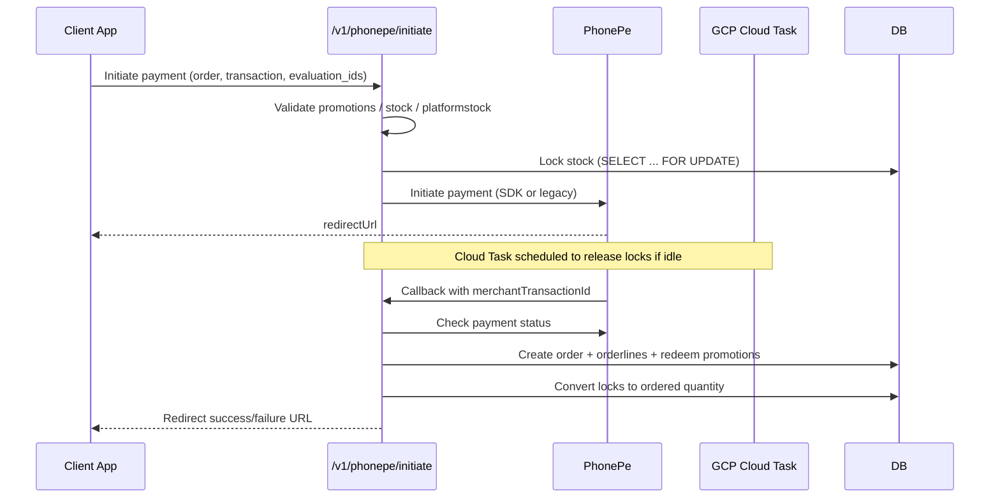

# PhonePe Payment Flow & Operations

This guide explains the end‑to‑end payment flow, operational safeguards, and the operational runbook for the PhonePe integration.

---

## 1. Architecture

- **Route layer** (`phonepe.route.ts`): schema validation, swagger definitions, route wiring.
- **Controller layer** (`phonepe.controller.ts`): orchestrates validation, stock locking, order creation, promotion redemption, and logging.
- **Service layer**: dedicated services for PhonePe API access, orders, orderlines, transactions, promotion evaluation/redemption, and stock cleanup via GCP Cloud Tasks.

### High-level flow



---

## 2. Validation Pipeline

1. **Promotion validation**
   - Valid evaluations applied; expired/cancelled ones block the order.
   - Usage-limit promotions are skipped with warnings (order still proceeds).
2. **Product validation**
   - Confirms product exists and has available quantity.
3. **Platform stock validation**
   - Checks platform-specific availability (`platformStock.availableqty - lockqty`).

Failures return actionable 400 responses (e.g. `PRODUCT_VALIDATION_FAILED`, `PROMOTION_EXPIRED_OR_INVALID`).

---

## 3. Stock Locking & Cleanup

- Locks are obtained with `SELECT ... FOR UPDATE` inside a Prisma transaction; this eliminates race conditions.
- A GCP Cloud Task is scheduled (default 120s) to release locks if payment does not complete.
- Cleanup endpoint `/v1/phonepe/cleanup-lock` checks payment status before releasing locks.

| Mode | Lock behaviour |
| --- | --- |
| PhonePe | Lock during initiation, convert to order on success, release via task on failure/timeout |
| COD | Lock during initiation, convert immediately on order creation |

---

## 4. Order Creation & Promotions

- `createOrderAfterPayment` is the single entry point for both PhonePe callbacks and COD creation.
- It uses the original payload stored in the transaction to build enriched order items (see `orderline-discount-fix.md`).
- Promotion redemption is deferred until payment success to avoid double usage.
- On failure to redeem, the order is marked for manual review (logged with `CRITICAL` severity).

---

## 5. Logging & Observability

Key log markers (searchable):

| Marker | Meaning |
| --- | --- |
| `promotion_evaluation validation` | Outcome of coupon validation |
| `automatic_orderlines_verified` | Orderlines auto-created after order |
| `Orderline promotion data mapping completed` | Discount distribution summary |
| `product quantity updates completed` | Stock conversion result |
| `cleanup-lock` | Cloud Task lock release audit |

Recommended alerts/metrics:

- `validations.allValid=false` in enrichment logs.
- High failure rate while updating product quantities.
- Cloud Task lock releases > expected threshold (indicates payment drop-offs).

---

## 6. Security & Compliance

- All PhonePe requests include checksums; responses are verified (SDK signature or legacy checksum).
- Webhook handlers validate `authorization`/`x-verify` headers before processing.
- Transactions store PhonePe responses, status history, and timestamps in `transactiondata.phonePeResponses`.
- No sensitive fields (keys, JWTs) are logged.

### Recommended hardening

- Enable idempotency keys on initiation requests (future enhancement).
- Add rate limiting for `/initiate` per user/device.
- Monitor for repeated cleanup events per merchantTransactionId.

---

## 7. Operations Runbook

### Deploying changes

1. `npm run build` (already part of CI/CD pipeline).
2. Deploy container/service; ensure env vars for PhonePe and Cloud Tasks are present.
3. Smoke test endpoints:
   - `/v1/phonepe/initiate` (PhonePe + COD).
   - `/v1/phonepe/create-sdk-order` (SDK token).
   - `/v1/phonepe/cleanup-lock` (manual POST with a test transaction id).

### Post-deploy verification

- Create a test order; run `sql/verify_orderline_fix.sql` (see `orderline-discount-fix.md`).
- Confirm logs show `validations.allValid: true`.
- Check Cloud Task queue for the scheduled cleanup.

### Common issues

| Symptom | Resolution |
| --- | --- |
| Locks remain after payment | Trigger `/cleanup-lock`; inspect Cloud Task logs |
| Promotions not redeemed | Check `PromotionRedemptionService` logs; verify evaluation IDs stored in transaction |
| Order creation fails | Review `createOrderAfterPayment` validation logs; confirm original payload completeness |

---

## 8. Data Verification Queries

```sql
-- Promotion totals vs orderlines
SELECT o.id,
       o.promotion_discount_total AS order_promo,
       SUM(ol.promotion_discount_amount) AS line_promo,
       ABS(o.promotion_discount_total - SUM(ol.promotion_discount_amount)) AS diff
FROM orders o
JOIN orderline ol ON o.id = ol.orderid
WHERE o.id = $1
GROUP BY o.id;

-- Order amount reconciliation
SELECT o.id,
       o.orderamount,
       SUM(ol.orderamount) AS line_total,
       ABS(o.orderamount - SUM(ol.orderamount)) AS diff
FROM orders o
JOIN orderline ol ON o.id = ol.orderid
WHERE o.id = $1
GROUP BY o.id;
```

`diff` should be `< 0.01` for compliant orders. Investigate anything larger.

---

## 9. Revision History

| Date | Change |
| --- | --- |
| 2025‑11‑05 | Consolidated flow, validation, and operations guidance |
| 2024‑10‑16 | Initial deep-dive documentation |


